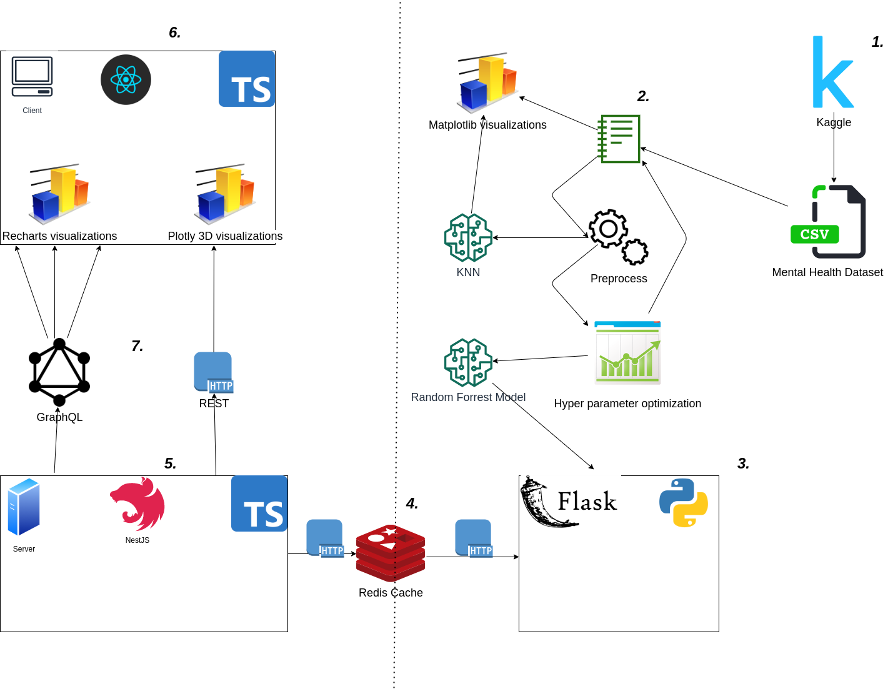
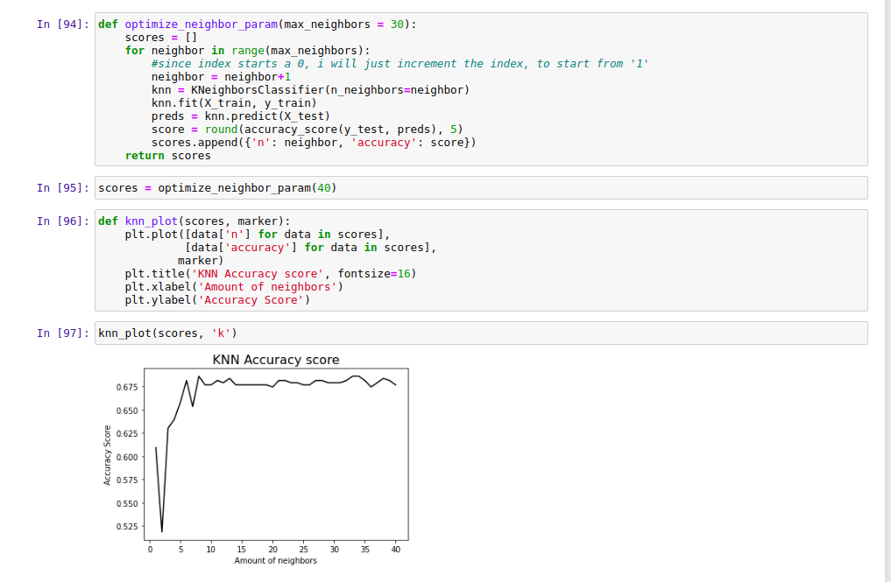

This is the README.md file, that will describe my business intelligence project, and a walkthrough of each the studypoint solution assignments.
 
 
> Assignment 1  
> Business Case Foundation.
 
For this assignment i wanted to explore the capabilities of creating a technology-driven process for analyzing data and delivering user feedback for mental health.
 
I thought mental health was an interesting business case, because Mental Health is a very modern topic after the Covid pandemic in 2019.
 
Below I have created a diagram that describes the workflow and different components of the system that I want to emphasize in this project.
 

 
Above is an illustration of the complete architecture of the application.
 
<ol>
<li> The first component we need is the mental health dataset from kaggle. You can find the dataset from this [link](https://www.kaggle.com/osmi/mental-health-in-tech-survey). This data set was downloaded and extracted in the jupyter notebook  <i>mental_health_notebook.ipynb</i>
 
This dataset is used as the baseline for the project. I thought mental health in the workplace would be a very essential starting point for this application.
 
The dataset only contained around 1500 entries, but it contained a lot of columns <i>(features)</i>, and this is very different from what I'm used to working with.
 
Previously I have mostly worked with larger datasets, with only a few features. As it is also present in the notebook, this required a lot more </i>preprocessing</i>, and a lot more <i>Hyper Parameter Optimization</i> to get the model giving a good predictions
<li>
The Jupyter notebook is pretty well documented, but i want to put in a few words of how I wanted to design the structure of the notebook.
 
I used a very traditional flow while first doing some data exploration, where I looked into the different features and the correlation between the features.
 
Then i renamed the columns, and did traditional preprocessing steps of removing <i>NaN, 0, null </i> values etc.
 
Replaced gender values with <b>One </b> value for each gender.
 
I played around with some different models, and decided to go for a <b>Random Forrest classifier in the end </b>  
I also used the <b>KNN </b> model from <i>Sklearn </i>.
 
Where i tried to optimize the amount of neighbors in the function
 

 
In the above code we define a function with a single argument <i>
max_neighbors </i>
 
indicating how many neighbors we want to research.
 
We then append them fit the model based on each neighbor index and return the scores and plot them in <i>matplotlib </i>
To see the different scores
 
</li>
 
<li>
I have also created a flask server, which is used to create prediction, and retrieve the columns, this is done by storing the model and the columns into a <i>pickle</i> file stored in the <i>models</i> folder.
 
This enables up to send the columns to the backend server, where it can present the columns (also referred to as features in ML context).
 
Using this pattern we can create a two way communication from our flask server to our actual backend. We can use a <i>GET </i> request to retrieve the columns, while we can use a <i>POST </i> request to "post" a rating to the backend where the prediction is sent back.
 
I chose this all through the backend server and not directly from the client.
</li>
 
 <li>
 Furthermore i also implemented a Redis cache, to store the questions to decrease redundancy in the application. This was to mimick a real life application a bit more. 

 In Business Intelligence we also want to optimize for performance so we provide our end-users with the best possible user experience. Therefore i created a <i>Redis </i> cache, so all the question that are retrived from the Flaks server (in this case it is the mental health columns), we want to save them for the next user, that has to fetch them. 

</ol>
 
 
 
> Assignment 2  
 
 
 
> Assignment 3  
 
 

