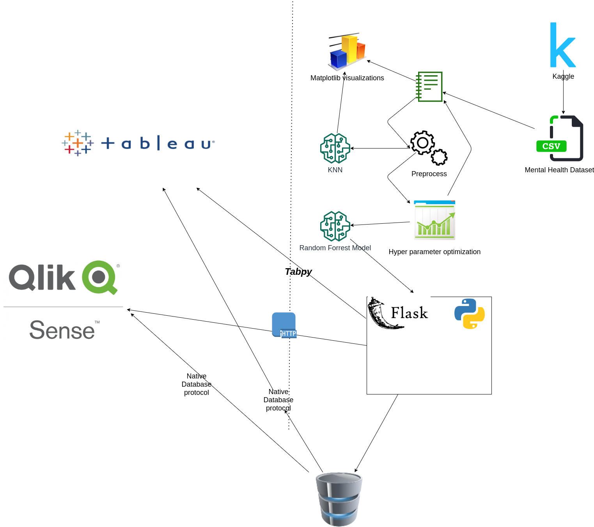

This is the README.md file, that will describe my business intelligence project, and a walkthrough of each of the studypoint solution assignments.
## Business Case Foundation.
For this assignment I wanted to explore the capabilities of creating a technology-driven process for analyzing data and delivering user feedback for mental health.
I thought mental health was an interesting business case, because Mental Health is a very modern topic after the Covid pandemic in 2019.
Below I have created a diagram that describes the workflow and different components of the system that I want to emphasize in this project.

Above is an illustration of the complete architecture of the application.
<ol>
<li> The first component we need is the mental health dataset from kaggle. You can find the dataset from this [link](https://www.kaggle.com/osmi/mental-health-in-tech-survey). This data set was downloaded and extracted in the jupyter notebook  <i>mental_health_notebook.ipynb</i>
This dataset is used as the baseline for the project. I thought mental health in the workplace would be a very essential starting point for this application.
The dataset only contained around 1500 entries, but it contained a lot of columns <i>(features)</i>, and this is very different from what I'm used to working with.
Previously I have mostly worked with larger datasets, with only a few features. As it is also present in the notebook, this required a lot more </i>preprocessing</i>, and a lot more <i>Hyper Parameter Optimization</i> to get the model giving a good predictions
<li>
The Jupyter notebook is pretty well documented, but i want to put in a few words of how I wanted to design the structure of the notebook.
 
I used a very traditional flow while first doing some data exploration, where I looked into the different features and the correlation between the features.
Then i renamed the columns, and did traditional preprocessing steps of removing <i>NaN, 0, null </i> values etc.
 
Replaced gender values with <b>One </b> value for each gender.
I played around with some different models, and decided to go for a <b>Random Forest classifier in the end </b>  
I also used the <b>KNN </b> model from <i>Sklearn </i>.
Where i tried to optimize the amount of neighbors in the function

In the above code we define a function with a single argument <i>
max_neighbors </i>
indicating how many neighbors we want to research.
We then append them fit the model based on each neighbor index and return the scores and plot them in <i>matplotlib </i>
To see the different scores
</li>
<li>
I have also created a flask server, which is used to create prediction, and retrieve the columns, this is done by storing the model and the columns into a <i>pickle</i> file stored in the <i>models</i> folder.
This enables up to send the columns to the backend server, where it can present the columns (also referred to as features in ML context).
Using this pattern we can create a two way communication from our flask server to our actual backend. We can use a <i>GET </i> request to retrieve the columns, while we can use a <i>POST </i> request to "post" a rating to the backend where the prediction is sent back.
I chose this all through the backend server and not directly from the client.
</li>
<li>
Furthermore I also implemented a Redis cache, to store the questions to decrease redundancy in the application. This was to mimic a real life application a bit more.
 
In Business Intelligence we also want to optimize for performance so we provide our end-users with the best possible user experience. Therefore I created a <i>Redis </i> cache, so all the questions that are retrieved from the Flask server (in this case it is the mental health columns), we want to save them for the next user, that has to fetch them.
 
</ol>
 
 
## Alternative solutions
 
For this project I decided to create my own frontend, and create all the visualizations by myself. Alternatively a BI-tool like <i>Tableau</i> or <i>Qlik Sense</i> could have been used.
For Tableau we have worked with <i>TabPy</i>, which is a well supported library to make integrations with tableau. This is especially useful for integrating many Machine Learning related applications, because they are typically written in python.
 
Below I have made a diagram of an alternative architecture that could have been used for this project.
 
 

<i>In the diagram above, I try to describe a different solution that could be applied if we used a third party software tool for Business Intelligence like Tableau and Qlik sense. This would require less components, as I could have created the implementation directly from the Flask Server. We could have used <i>TabPy</i> to create integrations with Tableau (or http), or we could have used native database drivers to extract the data directly from the database. While researching I found that Qlik Sense had an equally large ecosystem, and native database driver for almost any modern database software. </i>
 
There are pro's and con's by using an existing BI tool, and reflecting back on the work process, implementing the frontend myself created a lot of overhead in this example.
 
Pros:
<ul>
<li>Larger BI tools like Tableau have a very extensive ecosystem, and endless integrations. It can be implemented easily with almost any source system. </li>
 
<li>It does not require any programming knowledge. This enables business analysts and other people with non-programming skills to create their own visualizations very easily, and use their domain knowledge in a better way. than a programmer can do </li>
 
<li>Because Tableau and other BI-tools are third-party software, it requires little to no maintenance, and makes it easier to maintain software applications </li>
 
<li>Tableau has a lot of visualization tools, data engineering and Machine Learning tools which would be very hard to implement yourself </li>
</ul>
 
Cons:
<ul>
<li>We lose control over the source code. If we create our own frontend, we have full control over the source code, and create any kind of implementation we want</li>
 
<li>Costs. Tableau and other BI-tools have licensing fees, which can be expensive in many cases. Especially for start-ups and smaller enterprises with a small budget
</ul>
 
## Learning Points
 
As my intention was to create an actual software application, which encapsulated a lot of logic, I decided to use React as the Frontend for this. React has a lot of visualization tools, which are open source, but it still required a lot of effort to make the implementations.
 
 
Even though a BI tool like tableau would not have been able to create the logic in the same way, it could have automated the visualizations and the data processing, which would have removed a lot of overhead and future maintenance of the application.
 
 
It was a learning experience creating everything in code, and not using any External BI-tools. In retrospect however I realized that BI-tools, could have extended the functionality even for the current state of the application.
 
 
I would have liked to implement an Admin Dashboard application to provide data insight and visualizations over the users behaviour, when using the application. This would provide value to stakeholders of the application, and create an extensive application that would be very easy to integrate with other components of the system.
 
 
I also wanted to create a chatbot (the chat component is implemented in the frontend, but not yet finished). The chatbot would allow the users to easier navigate the system, and I believe the use case of mental health is very relevant because many people who experience mental health issues, will also have a hard time communicating their thoughts. Here a chatbot could be helpful and help users navigate around the application and provide feedback on their progress
 

